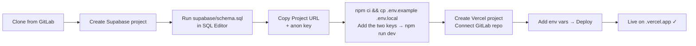
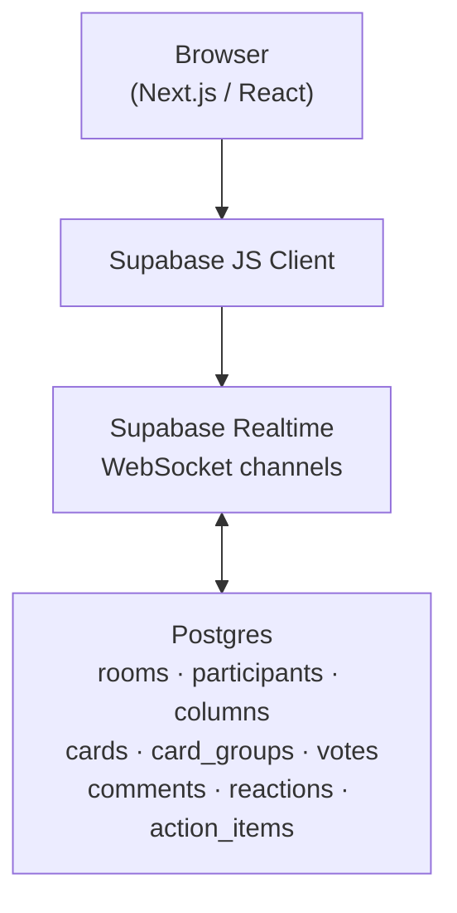

<p align="center">
  
</p>

<h1 align="center">Product Retro Tool</h1>

<p align="center">
  Currently branded as <strong>paraboll.online</strong> &nbsp;·&nbsp; Realtime retrospective tool for Product teams
</p>

<p align="center">
  
  
  
  
  
  
</p>

---

## What is this?

A realtime retrospective board built for speed and clarity. Create a room, share a link, run a structured retro with your team — no account wall, no friction.

- **Reflect** — private writing phase, cards hidden to reduce anchoring bias
- **Group** — drag and cluster related ideas on a shared board
- **Vote** — configurable per-participant vote limits
- **Discuss** — facilitator-driven carousel through top groups
- **Export** — markdown summary at the end of every session

All state is realtime: participants, cards, votes, comments, reactions and action items update instantly across every connected client via Supabase Realtime.

---

## ⚡ 5-minute setup

> [!IMPORTANT]
> A new owner needs **only two environment variables** and accounts on **Supabase** (free) and **Vercel** (free).
> No custom domain. No DNS. No Cloudflare. No existing deployment.



### Step-by-step

**1 — Clone the repository**

```bash
git clone <GITLAB_REPOSITORY_URL>
cd product-retro-tool
```

**2 — Create a Supabase project**

1. Go to [supabase.com](https://supabase.com) → **New project**
2. Choose any region, set a database password, wait ~2 min for provisioning

**3 — Bootstrap the database**

1. Open **SQL Editor** in the Supabase dashboard
2. Paste the entire contents of [`supabase/schema.sql`](./supabase/schema.sql)
3. Click **Run** — all tables, indexes, triggers, RLS policies and realtime publication are created in one shot

> [!NOTE]
> `supabase/schema.sql` is the **canonical fresh-install source of truth**.
> The `supabase/migrations/` folder contains historical incremental migrations kept for development context.
> When setting up a new project, **only run `schema.sql`** — do not replay the individual migration files.

**4 — Retrieve your Supabase credentials**

In the Supabase dashboard → **Project Settings → API**:

| Variable | Where to find it |
|---|---|
| `NEXT_PUBLIC_SUPABASE_URL` | **Project URL** |
| `NEXT_PUBLIC_SUPABASE_ANON_KEY` | **anon / public** key |

**5 — Run locally**

```bash
npm ci
cp .env.example .env.local
# Fill in the two variables in .env.local
npm run dev
```

Open [`http://localhost:3000`](http://localhost:3000) — the app is ready.

**6 — Deploy to Vercel**

1. [vercel.com](https://vercel.com) → **Add New Project** → Import from GitLab
2. Vercel detects Next.js automatically
3. **Environment Variables** → add `NEXT_PUBLIC_SUPABASE_URL` and `NEXT_PUBLIC_SUPABASE_ANON_KEY`
4. **Deploy**
5. Use the generated `*.vercel.app` URL — no custom domain required

---

## Environment variables

> [!IMPORTANT]
> These are the **only two required variables**:

```env
NEXT_PUBLIC_SUPABASE_URL=https://your-project.supabase.co
NEXT_PUBLIC_SUPABASE_ANON_KEY=your-anon-public-key
```

Everything else is optional legacy/marketing configuration:

| Variable | Default | Notes |
|---|---|---|
| `NEXT_PUBLIC_SITE_URL` | Auto-detected | Overrides canonical URL. Omit unless you set a custom domain. Vercel's `VERCEL_URL` is used automatically otherwise. |
| `NEXT_PUBLIC_LEGAL_SIRET` | *(unset)* | Displayed on legal pages only |
| `CRON_SECRET` | *(unset)* | Only needed if you add authenticated cron endpoints |

---

## Architecture



All active clients subscribe to relevant room channels. Writes go directly to Postgres via the Supabase client; Realtime broadcasts the changes to every other subscriber in that room.

---

## Repository structure

```
app/
  (tool)/           # Retro tool routes (room, retro, ongoing)
  api/              # Edge/server route handlers (og image, keep-alive)
  blog/             # Marketing blog pages
  templates/        # Template showcase pages
  layout.tsx        # Root layout + metadata
  page.tsx          # Marketing home
  sitemap.ts        # Dynamic sitemap
  robots.ts         # robots.txt

components/
  brand/            # Logo and brand marks
  marketing/        # Landing page components
  retro/            # All live-board components

lib/
  brand.ts          # Product name, site URL resolution
  marketing/        # Blog articles, template definitions
  retro/            # State helpers, types, realtime logic
  supabase/         # Supabase client initialisation
  legal/            # Legal page copy

public/
  brand/            # Logo assets
  music/            # Background music clips

supabase/
  schema.sql        # ← Fresh-install database bootstrap (run this)
  migrations/       # Historical incremental migrations (dev reference)

docs/
  DEPLOYMENT.md     # Deployment reference
```

---

## Local development

**Requirements:** Node.js ≥ 18 (Next.js 15 minimum)

```bash
git clone <GITLAB_REPOSITORY_URL>
cd product-retro-tool
npm ci
cp .env.example .env.local
# Edit .env.local — add NEXT_PUBLIC_SUPABASE_URL and NEXT_PUBLIC_SUPABASE_ANON_KEY
npm run dev
```

```
http://localhost:3000
```

| Script | Purpose |
|---|---|
| `npm run dev` | Start local dev server |
| `npm run build` | Production build |
| `npm run typecheck` | TypeScript type check |

---

## Supabase Free plan note

> [!NOTE]
> The project runs on the Supabase Free tier without issues.
> Free projects that receive no activity for an extended period may be **automatically paused** by Supabase.
> If the app appears unavailable, open the [Supabase Dashboard](https://supabase.com/dashboard), find the project, and click **Resume project**. No data is lost and no database recreation is needed.

---

## Routes

| Path | Purpose |
|---|---|
| `/` | Marketing home |
| `/retro` | Create / name a retrospective room |
| `/room/[roomId]` | Live collaborative board |
| `/templates` | Template gallery |
| `/blog` | Blog |
| `/privacy` · `/terms` · `/security` | Legal pages |

---

## Security

> [!WARNING]
> **This product has no authentication.** Rooms are link-accessible and fully anonymous by design — this is intentional for the MVP collaboration model.
>
> Row Level Security is **enabled but permissive**: any bearer of a room link can read and write to that room.
>
> Do not use this tool for sensitive or confidential retrospective content without first hardening RLS policies, adding authenticated users, and enforcing room membership checks.

---

## Development workflow

This is an internal Lemonway Product Team project. For contributions:

1. Create a branch from `main`
2. Keep changes focused — one feature or fix per branch
3. Test locally with `npm run dev` and `npm run typecheck`
4. Open a **GitLab Merge Request** with a clear description and, for UI changes, before/after screenshots

---

## Brand & UI guide

Visual language, color palette, and component conventions:

→ [`.claude/BRAND_AND_UI_GUIDE.md`](./.claude/BRAND_AND_UI_GUIDE.md)
